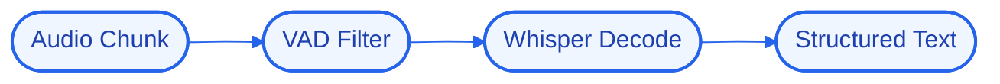

# Architecture — WhisperNexus

## High-Level Design (HLD)
WhisperNexus wraps Faster-Whisper behind a VAD filter and emits typed transcript objects (segments, timings, confidence) validated with PydanticAI so downstream code never parses loose strings.

**Flow:** Audio Chunk → VAD Filter → Whisper Decode → Structured Text

## Low-Level Design (LLD)
- **Components:** `Python`, `Faster-Whisper`, `PydanticAI`
- **Interfaces / contracts:** to be finalized during implementation.
- **Data model:** to be defined per component.

## Decision Log
- **Why this stack:** **Python** — ai & data-processing services; **Faster-Whisper** — optimized asr inference; **PydanticAI** — type-safe agent outputs.
- **Antigravity constraint:** run logic/state/UI locally; offload heavy reasoning to cloud APIs; target modest hardware.

## Concept Deep Dive
Turning a probabilistic model into a contract — structured, validated output that the rest of the system can trust.
